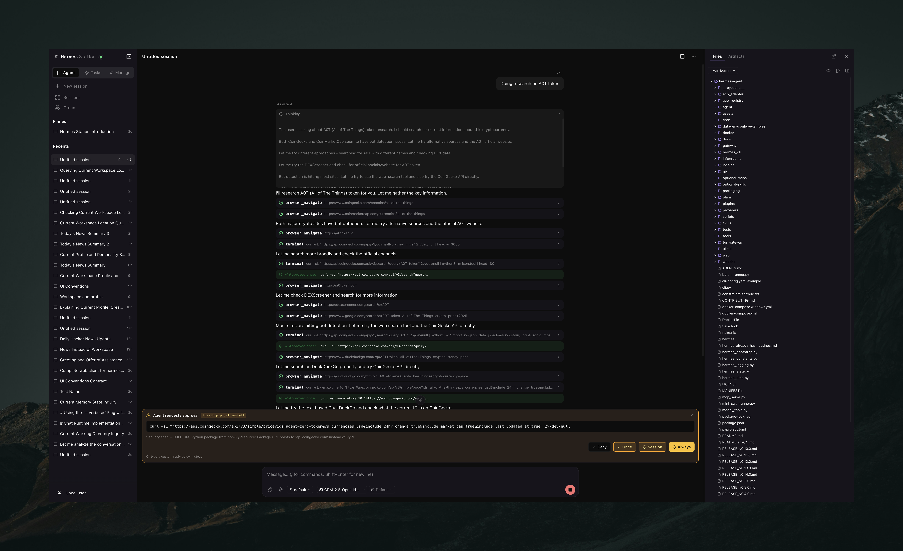

<div align="center">


# Hermes Station

**The complete web client for [`hermes-agent`](https://hermes-agent.nousresearch.com)'s gateway — chat, sessions, files, models, skills, and approvals in one place.**

[](LICENSE)
[](https://hermes-agent.nousresearch.com)
[](https://nodejs.org/)
[](https://www.python.org/)
[](AGENTS.md)

</div>

## Introduction

Hermes Station is the **complete web client** for `hermes-agent`'s gateway —
its north star is that **every capability reachable from the CLI or any
messaging platform is also reachable here**. It ships as an **in-process
platform plugin**: when the gateway boots it discovers Station, instantiates
[`StationAdapter`](server/adapter.py), and the adapter starts an aiohttp
server **inside the same Python process** as the agent runtime. There is no
IPC to the agent — Station calls `AIAgent.run_conversation()` as a function
on a worker thread, so `agent_importable` *is* the liveness signal.

The frontend is a React 19 + Vite + Zustand SPA; the backend is aiohttp on
`:1313`, with a multi-panel UI driven over REST (`/api/*`) and a WebSocket
(`/ws`).

```
        ┌──────────────────────────────┐
        │  React SPA                   │
        │  Vite :3131 (dev) / served   │
        │  by Python in prod           │
        └───────────────┬──────────────┘
                        │ /api/* and /ws
        ┌───────────────▼──────────────┐
        │  hms plugin (aiohttp, :1313) │
        │  + StationAdapter            │
        └───────────────┬──────────────┘
                        │ in-process
        ┌───────────────▼──────────────┐
        │  hermes-agent gateway        │
        │  (AIAgent, tools.approval,   │
        │   hermes_state.SessionDB)    │
        └──────────────────────────────┘
```

## ✨ What's inside

**Agent core**
- **Chat** (`/chat`) — live streaming conversation with the agent: model /
  profile / reasoning-effort pickers, slash commands, a context-window
  meter, and image / audio / video / document attachments.
- **Approvals** — the upstream 4-choice tool-approval flow
  (once / session / always / deny) bridged onto WebSocket frames.
- **Sessions** (`/sessions`) — browse, search (FTS), preview, rename, export,
  and delete every persisted session.
- **Group** (`/group`) — handoff / sub-agent view.

**Capability management**
- **Models** (`/models`) — providers, API keys, and per-task model assignment.
- **Skills** (`/skills`) & **Plugins** (`/plugins`) — install, enable, inspect.
- **Channels** (`/channels`) — the gateway's connected messaging platforms.
- **Profiles** (`/profile`) — multiple `HERMES_HOME`s, each its own gateway
  and `config.yaml`.
- **Settings** (`/settings`) — Preferences · Appearance · Security · System ·
  **Advanced** (a profile-aware `config.yaml` editor with a FORM ⇄ YAML toggle).

**Workspace**
- **Files** (`/files`) — workspace file tree + editor with version history,
  scoped to `~/.hermes` or a chosen workspace.
- **Cron** (`/cron`) & **Kanban** (`/kanban`) — scheduled jobs and a task board.

**Observability**
- **Analytics** (`/analytics`) & **Logs** (`/logs`) — token/cost charts and
  live gateway logs. Station also supervises the upstream Dashboard and
  transparently proxies `/api/dashboard/*`.

Cross-cutting: WebSocket live updates, light/dark themes, and English / 中文
localization.

## 📸 Screenshots



<!--
|                 Chat                  |                   Sessions                    |
| :-----------------------------------: | :-------------------------------------------: |
|   |   |
-->

## 🚀 Quick Start

**Requirements**

- Python 3.11+ with `hermes-agent` installed at `~/.hermes/hermes-agent/venv`
  (the conventional location)
- Node 20+ with `pnpm` 9+
- macOS or Linux

**Install as a gateway plugin**

```bash
# 1. Frontend deps
pnpm install

# 2. Install the plugin package into the hermes-agent venv so the
#    `hms` CLI is available.
~/.hermes/hermes-agent/venv/bin/python -m pip install -e .

# 3. (Optional) put `hms` on PATH:
#    ln -s ~/.hermes/hermes-agent/venv/bin/hms /usr/local/bin/hms

# 4. Register the plugin + enable it in config.yaml (idempotent).
hms install

# 5. Enable autostart for the gateway service (skip if already managed).
hermes gateway install

# 6. Start (or restart) the gateway so it picks up the plugin.
hermes gateway start          # cold start
# or: hms restart             # SIGUSR1 reload of an already-running gateway
```

`hms install` is idempotent — re-running refreshes the symlinks and ensures
`platforms.station` exists in `~/.hermes/config.yaml`. See
[`docs/PLUGIN_INSTALL.md`](docs/PLUGIN_INSTALL.md) for install paths in detail.

**Runtime modes**

| Mode | How | Visibility |
|---|---|---|
| **Production** | `hms install` → `hermes gateway restart` | Gateway loads `StationAdapter` in-process; shows on the Dashboard's *Connected Platforms*. |
| **Dev** | `pnpm dev` (boots `python -m server dev --reload` + Vite) | Standalone aiohttp with hot-reload, but invisible to the gateway / Dashboard. Use only while iterating on `server/` code. |

**Daily dev loop**

```bash
pnpm dev
```

Open <http://localhost:3131> — the only port dev uses. Vite serves the SPA
there with HMR and proxies `/api/*` + `/ws` to the Python backend. In dev the
backend listens on a Unix socket (`~/.hermes/run/station-dev.sock`) instead of
a TCP port, so it never clashes with the production gateway (`:1313`). Override
the interpreter with `HMS_PYTHON=/path/to/python pnpm dev`.

## 🔒 Security

> **Station is designed for a single trusted user on a trusted host.**
> Any request arriving from loopback (`127.0.0.0/8` / `::1`) is treated as
> fully authenticated — no password, full API access (see
> [`server/auth.py`](server/auth.py)). This means **every local process and
> every local user on the machine can drive the agent**, which can run
> arbitrary shell commands. Do not run it on a shared/multi-user host.
>
> Password auth (`password_hash`) only gates **non-loopback** access, and is
> *required* before binding `host: 0.0.0.0`. If you put a reverse proxy in
> front, it must set `X-Forwarded-For` correctly — otherwise LAN traffic
> arriving over loopback will be misclassified as trusted-localhost.

## 🛠️ CLI

```text
hms install [--force]   symlink the plugin + patch config.yaml
hms uninstall           remove the symlinks + the platforms.station section
hms status              show plugin + upstream gateway state
hms start | stop        start/stop the gateway service (launchd/systemd)
hms restart             SIGUSR1 the running gateway (graceful reload)
hms dev                 alias for `pnpm dev` (Vite HMR :3131 + Unix-socket backend)
hms dev --port N        run just the backend on TCP :N (e.g. for smoke scripts)
```

## ⚙️ Configuration

Configure under the root-level `platforms:` mapping in `~/.hermes/config.yaml`:

```yaml
platforms:
  station:
    enabled: true
    extra:
      host: 127.0.0.1                # 0.0.0.0 requires password_hash
      port: 1313                     # Station backend bind (Vite dev uses 3131)
      session_ttl_seconds: 86400
      max_concurrent_runs: 10
      max_upload_bytes: 52428800     # 50 MiB
      upload_retention_days: 30
      cors_origins: []
      password_hash: |-              # argon2id; set via Settings → Security
        $argon2id$v=19$m=65536,t=3,p=4$...$...
```

Env vars override the same keys at runtime — see [`.env.example`](.env.example).
The SPA's **Settings → Security / Advanced** tabs are the supported way to edit
without hand-editing YAML. Runtime tunables (via `GET /api/capabilities.limits`):

| Key | Default | Range |
|---|---|---|
| `max_concurrent_runs` | 10 | 1–100 |
| `max_upload_bytes` | 50 MiB | 1–500 MiB |
| `upload_retention_days` | 30 | 1–365 |

## 📎 Attachments

The Composer accepts **images** (`image/*`, inlined for vision models),
**audio** (`.mp3`, `.ogg`, `.wav`, …), **video** (`.mp4`, `.mov`, `.webm`, …),
and **text / documents** (`.pdf`, `.epub`, `.docx`, `.xlsx`, `.pptx`, `.md`,
`.json`, source code, …). Storage lives at
`~/.hermes/station/uploads/<id>/<name>`; a background sweep removes files older
than `upload_retention_days`.

## 🧪 Testing

```bash
# Backend unit tests
~/.hermes/hermes-agent/venv/bin/python -m pytest tests/unit/

# Frontend: types, lint, unit, build
pnpm typecheck
pnpm lint                 # ESLint, --max-warnings 0
./node_modules/.bin/vitest run
pnpm build

# Live smokes (boot the dev backend first via `pnpm dev`)
~/.hermes/hermes-agent/venv/bin/python scripts/smoke_api_routes.py
~/.hermes/hermes-agent/venv/bin/python scripts/smoke_run_ws.py
~/.hermes/hermes-agent/venv/bin/python scripts/smoke_approval_bridge.py
```

## 🧭 Architecture & docs

- [`ARCHITECTURE.md`](ARCHITECTURE.md) — system model, domain division, state
  ownership, and the boundaries that must not be crossed.
- [`AGENTS.md`](AGENTS.md) — contributor guide + house rules.
- [`PROJECT_CONSTITUTION.md`](PROJECT_CONSTITUTION.md) — the non-negotiables.
- [`DEBT.md`](DEBT.md) — the single, greppable technical-debt register.
- [`docs/`](docs/) — runtime topology, [WS protocol](docs/WS_PROTOCOL.md),
  [REST API](docs/REST_API.md), install paths, capability coverage,
  [UI conventions](docs/UI_CONVENTIONS.md), and development notes.

Key entry points: [`server/__init__.py`](server/__init__.py) (`register(ctx)`),
[`server/adapter.py`](server/adapter.py) (`StationAdapter`),
[`server/app.py`](server/app.py) (aiohttp factory + middleware),
[`server/runs.py`](server/runs.py) + [`server/ws.py`](server/ws.py) (run
lifecycle + WS fan-out), and
[`server/lib/upstream_shim.py`](server/lib/upstream_shim.py) (the single
boundary for all upstream imports).

## 🗑️ Uninstall

```bash
hms uninstall                       # remove symlinks + platforms.station
hermes gateway restart              # so the running gateway forgets us
```

## 💛 Support the project

If Hermes Station is useful to you, you can support its development:

**ETH:** `0x5355E74F9158B2882BCFcD2a69D9d4bDfc1f123f`

> Only send to this address on the following EVM-compatible networks:
> **Ethereum, Base, Polygon, Avalanche, Arbitrum, BNB.**

## 🤝 Contributing

Contributions are welcome! Before opening a PR, read [`AGENTS.md`](AGENTS.md)
(house rules) and [`PROJECT_CONSTITUTION.md`](PROJECT_CONSTITUTION.md), and
check [`DEBT.md`](DEBT.md) for tracked work.

- Bug fixes → open a PR directly.
- New features → open an issue first to discuss scope.
- All changes must pass CI: ruff, pytest, pyright, ESLint (`--max-warnings 0`),
  vitest, and the production build.

## 📄 License

MIT — same as `hermes-agent`. See [LICENSE](LICENSE) for the full text.

<div align="center">
  <sub>An <a href="https://hermes-agent.nousresearch.com">hermes-agent</a> platform plugin · MIT licensed</sub>
</div>
